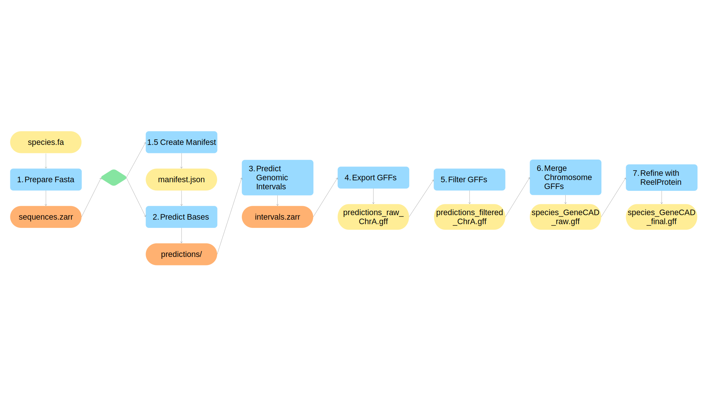

<div align="center">

# GeneCAD: Plant Genome Annotation with a DNA Foundation Model


[](https://opensource.org/licenses/Apache-2.0)
[](https://github.com/plantcad/genecad/actions/workflows/ci.yaml)
[](https://doi.org/10.1101/2025.10.31.685877)
[](https://www.python.org)
[](#step-1-download-and-install)
[](#using-docker)
[](https://github.com/plantcad/genecad/releases)
[](https://huggingface.co/plantcad/models)


GeneCAD is an *ab initio*, end-to-end genome annotation pipeline.
It leverages the DNA foundation model [PlantCAD2](https://doi.org/10.1101/2025.10.31.685877),
along with a modernBERT encoder and a conditional random field (CRF), to
predict gene structure directly from FASTA assemblies, without the need for additional
transcriptomic or proteomic information or direct sequence alignment.

GeneCAD predictions are returned in a standardized [GFF3 format](http://www.ensembl.org/info/website/upload/gff3.html)
and can be further refined using [ReelProtein](https://onlinelibrary.wiley.com/doi/10.1111/tpj.70483).
Currently, both plant and vertebrate models are available.

</div>

> [!WARNING]
> A significant problem was identified in GeneCAD v0.1.0 which caused low BUSCO scores. Please update to
> v0.2.0 or later for the best results.

<details><summary>More info</summary>
We identified a significant problem in previous versions regarding missing BUSCO genes
(thank you [MaizeGDB](https://www.maizegdb.org/) team for alerting us!). The model was failing
because of incosistencies in the model's training data and limitations in the previous
architecture. These problems have since been identified and fixed. If you downloaded GeneCAD
v0.1.0 or earlier, we recommend installing the latest version and re-running all predictions.
</details>


## Table of Contents
* [Quick Start](#quick-start)
* [Available Models](#available-models)
* [Advanced Usage](#advanced-usage)
  * [Train](#train)
  * [Predict](#predict)
  * [Evaluate](#evaluate)
  * [Summarize](#summarize)
* [Troubleshooting](#troubleshooting)
* [Citation](#citation)
* [Development](#development)

---

## Quick Start

#### Prerequisites

GeneCAD requires an NVIDIA GPU with a CUDA driver. Therefore, it cannot typically
be run on Macs. Linux (x86-64) operating systems are strongly recommended.

<details><summary>Detailed Requirements</summary>

| Requirement  | Minimum             | Recommended   | Notes                                                                  |
|--------------|---------------------|---------------|------------------------------------------------------------------------|
| OS           | Linux (x86-64)      | —             | macOS is not supported (no CUDA)                                       |
| GPU          | NVIDIA ≥ 16 GB VRAM | A100 / H100   | e.g. RTX 3090/4090 for development                                     |
| CUDA         | 12.4                | 12.8          | Must match PyTorch 2.7.1 build                                         |
| Python       | 3.12                | 3.12          | Managed automatically by `uv`                                          |
| Disk         | ~20 GB free         | —             | Model weights cached in `~/.cache/huggingface`                         |
| Hugging Face | Internet access     | Account login | Login only needed for rate limits, gated repos, or private checkpoints |

</details>


<details><summary>Throughput on Different GPUs</summary>

Observed GeneCAD inference throughput on different GPUs. Datacenter-class GPUs (A100/H100) are 3–6× more cost-efficient per megabase than consumer development GPUs.

| Provider | Instance            | Throughput (bp/s) | Cost ($/hr) | Cost per Mbp ($) |
|----------|---------------------|-------------------|-------------|------------------|
| GCE      | g2-standard-32 / L4 | 4,063             | 1.7344      | 0.1186           |
| Lambda   | gpu_1x_a100_sxm4    | 17,687            | 1.2900      | 0.0202           |
| Lambda   | gpu_1x_h100_pcie    | 22,020            | 2.4900      | 0.0314           |
| Lambda   | gpu_2x_h100_sxm5    | 34,290            | 6.3800      | 0.0517           |

Estimated cost for common reference plant genomes (using Lambda A100 at $0.0202/Mbp):

| Genome                      | Length (Mbp) | GPU Hours | Cost ($) |
|-----------------------------|--------------|-----------|----------|
| *Arabidopsis thaliana*      | 120          | 2.12      | 2.42     |
| *Zea mays* (corn)           | 2,182        | 34.27     | 44.04    |
| *Hordeum vulgare* (barley)  | 4,224        | 66.34     | 85.32    |
| *Triticum aestivum* (wheat) | 14,577       | 227.00    | 294.46   |

</details>


#### Download and Install

Recommended installation uses `uv` for environment management.
For other installation options see [Alternative Installation Methods](docs/alternative_installation_methods.md)
Docker/Singularity/Apptainer container images are available and may be useful when working on HPCs or in the cloud.

> [!IMPORTANT]
> GeneCAD requires a CUDA GPU. Installation must also be performed
> on machines with a CUDA GPU, or else the correct pytorch CUDA will not
> be installed.

```bash
# Download the GeneCAD repository
git clone https://github.com/plantcad/genecad.git
cd genecad

# Create a virtual environment and install GeneCAD
uv venv
source .venv/bin/activate
bash scripts/install_release.sh
```

#### Predict gene models

**Run a test example:**
Running the prediction pipeline with no argument downloads and annotates
_Arabidopsis thaliana_ as a test.
```bash
genecad predict
```

**Annotate your own genome:**

For a complete list of options, including multi-GPU
support, see [Advanced Usage - Prediction](#predict)

```bash
genecad predict \
  -i /path/to/genome.fa #Assembly fasta to be annotated \
  -o /path/to/output_dir #Directory for output files \
  -s species_name #Name of species \
  -m plant #choose model: plant or animal
```

#### Output

Output files and intermediate files are saved to the specified output directory.
There are two main output files: both are in GFF3 format and can be used with other
pieces of software such as **IGV**, **JBrowse2**, or **Apollo**.

`[species_name]_GeneCAD_raw.gff` contains the raw predictions from GeneCAD.

`[species_name]_GeneCAD_final.gff` contains the predictions after the ReelProtein filtering step.

> [!TIP]
> Use `*_final.gff` for most downstream purposes. The raw file is provided in case you want
> to perform any custom filtering process, but is not recommended for use as-is.

#### Evaluate prediction output

The evaluation pipeline is an optional step to compare GeneCAD predictions to an existing set of
genome annotations. Metrics include CDS recall, splice site motif distribution, and BUSCO scores.
See [Evaluate](#evaluate) for more details.

```bash
genecad evaluate \
  --ref   /path/to/reference.gff3 \
  --pred  /path/to/[species_name]_GeneCAD_final.gff \
  --fasta /path/to/genome.fa \
  --output report.txt
```

---

## Available Models

GeneCAD provides two pre-trained models for different taxonomic groups.
Both are downloaded automatically from Hugging Face on first run and cached
in `~/.cache/huggingface`. Internet access is required on the first run.

| Mode (`-m`)         | Organism type      | Base model                                                                                  | GeneCAD head                                                                |
|---------------------|--------------------|---------------------------------------------------------------------------------------------|-----------------------------------------------------------------------------|
| `plant` *(default)* | Plants             | [`emarro/pcad2-200M-cnet-baseline`](https://huggingface.co/emarro/pcad2-200M-cnet-baseline) | [`plantcad/genecad_plant`](https://huggingface.co/plantcad/genecad_plant)   |
| `animal`            | Vertebrate Animals | [`emarro/pcad2_vert_small`](https://huggingface.co/emarro/pcad2_vert_small)                 | [`plantcad/genecad_animal`](https://huggingface.co/plantcad/genecad_animal) |

### Legacy Models

<details><summary>Legacy Models</summary>

The following models are older versions and are not preset mode options in the `genecad predict` CLI: these model paths
must be specified directly. **We do not recommend using them for new predictions or analysis**: we provide them for backwards
compatibility and comparison purposes.

| Model name          | Organism type | Base model                                                                                                    | GeneCAD head                                                                                                    |
|---------------------|---------------|---------------------------------------------------------------------------------------------------------------|-----------------------------------------------------------------------------------------------------------------|
| `genecad-pc2-small` | Plants        | [`https://huggingface.co/kuleshov-group/PlantCAD2-Small-l24-d0768`](kuleshov-group/PlantCAD2-Small-l24-d0768) | [`plantcad/GeneCAD-l8-d768-PC2-Small`](https://huggingface.co/plantcad/GeneCAD-l8-d768-PC2-Small)               |
| `genecad-pc2-large` | Plants        | [`kuleshov-group/PlantCAD2-Large-l48-d1536`](https://huggingface.co/kuleshov-group/PlantCAD2-Large-l48-d1536) | [`plantcad/GeneCAD-l8-d768-PC2-Large`](https://huggingface.co/plantcad/GeneCAD-l8-d768-PC2-Large)               |
| `genecad-pc2-cnet`  | Plants        | [`emarro/pcad2-200M-cnet-baseline`](https://huggingface.co/emarro/pcad2-200M-cnet-baseline)                   | [`plantcad/GeneCAD-pcad2-200M-cnet-baseline`](https://huggingface.co/plantcad/GeneCAD-pcad2-200M-cnet-baseline) |

</details>

### Pre-downloading models (recommended for clusters without internet on compute nodes)

```bash
# Optional: log in if Hugging Face rate-limits anonymous downloads
huggingface-cli login

# Download the desired base and head model (~5 GB, cached in ~/.cache/huggingface)
huggingface-cli download emarro/pcad2-200M-cnet-baseline
huggingface-cli download plantcad/genecad_plant
```

Run these on the login node (which has internet access). When you
then run `genecad predict` on a compute node, the weights are loaded
from the local cache without any download.

---

## Advanced Usage

### Train

The training pipeline is useful for reproducing the training methodology for the GeneCAD models.
It can be run using either the command line interface `genecad train`
or the script `train.sh`. Both methods use the same set of options

> [!NOTE]
> At the current time, the training pipeline is not set up to add arbitrary new species for fine-tuning
> or retraining GeneCAD models. To add new species to the training pipeline, modify the train.sh script and add
> a new SpeciesConfig to src/config.py

#### Command line usage

```bash
genecad train [OPTIONS]
```
* `--domain` `-m` - Training domain. Options: plant, animal (Default: plant)
* `--output` `o` - Output directory for checkpoints and logs (Default: genecad_result/training/<domain>)
* `--run-name` `r` - WandB run name (Default: genecad-plant-multispecies)
* `--project` `p` - WandB project name (Default: genecad)
* `--gpus` `-g` - Comma-separated list of GPU IDs to use, or "all" to use all available GPUs (Default: 1)
* `--batch-size` `b` - Training batch size per GPU (Default: 4)
* `--effective` `e` - Effective batch size (Default: 384)
* `--lr` `-l` - Learning rate (Default: 2e-4)
* `--gff-parallel` - Number of parallel workers for GFF extraction by species (Default: 1)
* `--window-size` - Training window size (Default: 8192)
* `--intergenic-proportion` - Proportion of training window that are intergenic (Default: 0.15)
* `--base-frozen` - Freeze base encoder during training. Options: yes, no (Default set by domain)
* `--auto-class-weights` - Compute class weights from training set before training. Options: yes, no (Default yes)
* `--label-qc` - Run split/label QC before training. Options: yes, no (Default: yes)
* `--min-non-intergenic-ratio` - Fails run if the proportion of non-intergenic tokens is less than this amount (Default: 0.01)
* `--min-core-class-tokens` - Fails run if any core classes have fewer than this many tokens (Default: 100)
* `--base-model` - Overrides the base PlantCAD model set by `--domain`
* `--animal-input-dir` - Source directory for animal FASTA files (Default: <output>/pipeline/data/animal/fasta/training)
* `--animal-gff-dir` - Source directory for animal GFF files (Default: <output>/pipeline/data/animal/gff/training)
* `--hf-upload-repo` - Upload artifacts to this HuggingFace repo (Default: None)
* `--hf-upload-type` - Repo type. Options: model, dataset (Default: model)

> [!WARNING]
> While training can be performed on a single NVIDIA GPU, it is very slow. It is strongly recommended
> to parallelize training across two or more GPUs using the --gpu option

#### Pipeline Breakdown

> [!TIP]
> The `genecad train` pipeline is modular and fully **resumable** - if the output from a given
> step is present in the output directory, the pipeline will skip that step.

0. Download data - Fetch training FASTA and GFF3 files from HuggingFace repositories
1. Link - Create symlinks to standardize naming conventions as expected by the software config
2. Extract GFF - Parse gene annotations into a flat feature table (Parquet)
3. Tokenize - Tokenize genome sequences into .zarr format
4. Filter - Remove incomplete or invalid gene features
5. Stack - Convert features into genomic interval windows
6. Label - Assign per-token class labels from the filtered intervals
7. Split - Sample training windows and split into train/validation sets
8. Train - Fine-tune GeneCAD with Pytorch DDP + Pytorch Lightning

#### Outputs

```
<OUTPUT_DIR>/
├── training.log                        ← full training log (tee'd to stdout)
├── checkpoints/
│   └── *.ckpt                          ← Lightning checkpoints
└── pipeline/                           ← intermediate files (can be large)
    ├── extract/
    │   ├── raw_features.parquet        ← parsed gene annotations
    │   └── tokens.zarr                 ← tokenized genome sequences
    ├── transform/
    │   ├── features.parquet            ← filtered features
    │   ├── intervals.parquet           ← stacked genomic intervals
    │   ├── labels.zarr                 ← per-token class labels
    │   ├── sequences.zarr              ← sequence + label dataset
    │   └── windows.zarr                ← sampled training windows
    └── prep/
        └── splits/
            ├── train.zarr              ← training split
            └── valid.zarr              ← validation split
```

> [!WARNING]
> The `pipeline/` directory can be **several hundred GB** depending on genome sizes and number of
> species. It is safe to delete after training — checkpoints are self-contained. The pipeline is
> resumable, so intermediate files are preserved by default to avoid recomputation.

### Predict

For most users, we recommend running the prediction pipeline using the end-to-end command line
interface `genecad predict` or the associated bash script `predict.sh`. Both methods use the same
set of options.

#### Command line usage

```bash
genecad predict [OPTIONS]
```

* `--input-fasta` `-i` - Fasta sequence to be annotated. Gzipped files are supported.
* `--output-dir` `-o` - Output directory
* `--species-name` `-s` - Name of species or sample. Output files use this as a prefix.
* `--mode` `-m` - Mode, or set of models to use. Options: plant, animal. (Default plant)
* `--top-n-contigs` `-n` - Predict only the `N` longest fasta sequences in the input. Must be an integer or "all". (Default: all)
* `--min-transcript-length` `-l` - Minimum allowed transcript length. Shorter transcripts will be removed. (Default: 3)
* `--cpu-workers` `-c` - CPU workers used during GFF export. (Default: 1)
* `--batch-size` `-b` - Inference batch size for GPU (Default is auto-scaled to GPU VRAM)
* `--gpus` `-g` - Comma-separated list of GPU IDs to use, or "all" to use all available GPUs (Default: 0)
* `--launcher` - Custom entrypoint command to launch predict.py (e.g. 'srun python').
If set, overrides automatic DDP/SLURM detection. Can also be set via LAUNCHER environment variable.
(Default: python)
* `--model-checkpoint` - Overrides the GeneCAD head model set by `--mode`. Accepts a local path to a `.ckpt` file or a
HuggingFace model repo ID. Note that this does **not** override the base PlantCAD model set by `--mode`

#### Pipeline Breakdown

> [!TIP]
> The `genecad predict` pipeline is modular and fully **resumable** - if the output from a given
> step is present in the output directory, the pipeline will skip that step.

The individual components of the prediction pipeline are also accessible as python scripts.
While this is not the main recommended method to run the GeneCAD pipeline, some users may
find it useful to run individual steps for fine-grained control of parameters and/or
debugging purposes. Only some steps require a compatible GPU, so users with limited GPU access
may wish to run other steps on a CPU-only machine and transfer intermediate files as necessary.

Refer to the `docs/` folder for full parameter lists for each step/script.



1. [Prepare fasta](docs/extract_fasta.md) - `scripts/extract_fasta.py` - Converts fasta sequence to .zarr format for use in later steps
   1. (Optional) [Create manifest](docs/create_manifest.md) - `scripts/create_manifest.py` - Steps 2-5 process one chromosome/contig at a time.
   For convenience, this step creates a manifest file describing all the contigs in the input fasta, which can be passed in to each
   subsequent step to run all chromosomes sequentially.
2. [Predict bases](docs/predict.md) - `scripts/predict.py` - **REQUIRES GPU** - Uses the GeneCAD model to perform base-level prediction of genome annotations.
3. [Predict Genomic Intervals](docs/detect_intervals.md) - `scripts/detect_intervals.py` - Uses a custom CRF and the Viterbi algorithm to predict genomic
   intervals or regions from the base-level predictions.
4. [Export GFFs](docs/export_gff.md) - `scripts/export_gff.py` - Converts the genomic intervals to GFF format.
5. [Filter GFFs](docs/filter_raw_gff.md) - `scripts/filter_raw_gff.py` - Removes fragmented or excessively short gene models.
6. [Merge Chromosme GFFs](docs/merge_gff.md) - `scripts/merge_gff.py` - Merges per-chromosome GFF files into a single unified file.
7. [Refine with ReelProtein](docs/refine.md) - `scripts/refine.py` - **REQUIRES GPU** - Uses ReelProtein to evaluate  and filter gene models for likely
protein functionality and merges gene fragments.

#### Outputs

After running, the output directory contains:

```
<OUTPUT_DIR>/
├── <SPECIES_ID>_GeneCAD_raw.gff      ← all predicted gene models (pre-refinement)
├── <SPECIES_ID>_GeneCAD_final.gff    ← final, protein-validated annotations
└── <CHR_ID>/                         ← per-chromosome intermediates (for debugging)
    ├── predictions_filtered_<CHR_ID>.gff
    ├── predictions_raw_<CHR_ID>.gff
    ├── sequences_Chr01.zarr
    ├── predictions_Chr01.zarr
    └── intervals_Chr01.zarr
```

> [!TIP]
> GeneCAD intermediate files are typically several times larger than the input FASTA file
> and can easily be 10s-100s Gb in total. We recommend deleting the intermediate .zarr files
> after validating your final output GFFs.

### Evaluate

The evaluation pipeline runs a suite of evaluation tools to compare GeneCAD predictions to a
reference annotation. It is self-contained for Sections 1, 2, 3, and 5. Section 4 uses BUSCO
if you enable it, but BUSCO is optional. It can be run either using the `genecad evaluate`
command-line interface, or by running the python script `scripts/evaluate.py` directly.

> [!CAUTION]
> The evaluation script is designed to compare sorted protein-coding genes only.
> Filter any input GFF files for features other than protein-coding genes and their components
> before using this command.

#### Command Line Usage

```bash
genecad evaluate \
  --ref   /path/to/reference.gff3 \
  --pred  /path/to/Athaliana_GeneCAD_final.gff \
  --fasta /path/to/genome.fa \
  --output report.txt
```

* `--ref` - Reference annotations, in GFF3 format
* `--pred` - Predicted annotations, in GFF3 format (GeneCAD or other annotation tool)
* `--fasta` - Genome FASTA file (required for splice site analysis and BUSCO)
* `--lineage` - BUSCO lineage dataset (Default: embryophyta_odb10)
* `--cpu` - Number of CPUs to use for BUSCO (Default: 32)
* `--busco-out` - BUSCO output directory (Default: busco_eval/)
* `--busco-env` - conda/mamba environment name used for BUSCO auto-detection (Default: busco-5.5.0)
* `--busco-cmd` - Explicit BUSCO command prefix
* `--busco-activate-script` - Optional shell script to activate BUSCO environment
* `--skip-busco` - Skip the BUSCO section of the evaluation
* `--auto-install-busco` - If BUSCO software is missing, attempt to create environment `--busco-env` and install BUSCO there
* `--output` - Output report file (Default: stdout)
* `--fix-busco-env` - If BUSCO is broken, auto-repair the conda environment and retry

#### BUSCO Setup

In order to calculate BUSCO scores, the BUSCO software must be present in your environment. If BUSCO is already available
on your system, GeneCAD can pick it up automatically. If not, choose the option that matches your environment.

#### Specify BUSCO command directly

Use this option if BUSCO is not in your PATH, but is installed in an alternative location on your machine.

```bash
genecad evaluate \
  --busco-cmd /programs/busco-5.5.0/busco \
  --ref   /path/to/reference.gff3 \
  --pred  /path/to/Athaliana_GeneCAD_final.gff \
  --fasta /path/to/genome.fa \
  --output report.txt
```

#### Use a conda/mamba environment

Use this option if you have BUSCO installed in a dedicated conda or mamba environment.
Use `--auto-install-busco` to install BUSCO in the specified environment if it is not already installed.

```bash
genecad evaluate \
  --conda-env busco-5.5.0 \
  --ref   /path/to/reference.gff3 \
  --pred  /path/to/Athaliana_GeneCAD_final.gff \
  --fasta /path/to/genome.fa \
  --output report.txt
```

#### HPC with a site-wide activation script

Some HPCs may require a module activation to use certain software. If this is the case, activate
the module before running GeneCAD's evaluation pipeline, or specify the activation script.

```bash
genecad evaluate \
  --busco-activate-script /programs/miniconda3/bin/activate \
  --ref /path/to/reference.gff3 \
  --pred /path/to/prediction.gff3 \
  --fasta /path/to/genome.fa \
  --output report.txt
```
#### Skip BUSCO evaluation

Section 4 will not appear in the evaluation output

```bash
genecad evaluate \
  --skip-busco \
  --ref   /path/to/reference.gff3 \
  --pred  /path/to/Athaliana_GeneCAD_final.gff \
  --fasta /path/to/genome.fa \
  --output report.txt
```

> [!TIP]
> If you run BUSCO with `--augustus`, point `AUGUSTUS_CONFIG_PATH` to a writable directory:

```bash
mkdir -p "$HOME/augustus_config"
cp -r /programs/miniconda3/envs/busco-5.5.0/config "$HOME/augustus_config"
export AUGUSTUS_CONFIG_PATH="$HOME/augustus_config/config"
```

#### Outputs

<details><summary>Example output (*Arabidopsis thaliana*)</summary>

```
==============================================================
SECTION 1 – CDS-Based Evaluation (UTRs ignored)
  Gene is correct if its CDS chain matches ANY ref isoform.
==============================================================

  Reference : 26867 loci | 32588 transcripts | 145570 unique CDS exons
  Predicted : 25267 loci | 25267 transcripts | 137742 unique CDS exons

--- CDS-exon-level ---
  Precision : 0.9086   Recall : 0.8597   F1 : 0.8835

--- Locus-level ---
  Precision : 0.7571   Recall : 0.7120   F1 : 0.7338

--- Transcript-level ---
  Precision : 0.7571   Recall : 0.5870   F1 : 0.6613


==============================================================
SECTION 2 – Full Exon Evaluation (includes UTRs)
  Intron chain / Locus[IC]: multi-exon transcripts only.
==============================================================

--- Base level (nucleotides) ---
  Precision : 0.9907   Recall : 0.6801   F1 : 0.8065

--- Intron level (splice junctions) ---
  Precision : 0.9173   Recall : 0.7959   F1 : 0.8523

--- Intron chain level ---
  Precision : 0.6179   Recall : 0.3677   F1 : 0.4610


==============================================================
SECTION 3 – Splice Site Analysis
==============================================================

  Total introns analysed : 112475
  GT-AG (canonical)      : 110788  (98.50%)
  GC-AG (semi-canonical) :   1687  ( 1.50%)
  Other (non-canonical)  :      0  ( 0.00%)


==============================================================
SECTION 4 – BUSCO Evaluation
==============================================================

  C:99.1%[S:98.2%,D:0.9%],F:0.5%,M:0.4%,n:2326
  2306  Complete BUSCOs (C)
    12  Fragmented BUSCOs (F)
     8  Missing BUSCOs (M)


==============================================================
SECTION 5 – Site-Level Error Breakdown
  TIS = Translation Initiation Site
  TTS = Translation Termination Site
==============================================================

  Site             Ref    Pred      TP     FP     FN    Prec     Rec      F1
  TIS            28301   25267   23006   2261   5295  0.9105  0.8129  0.8589
  TTS            28340   25267   22998   2269   5342  0.9102  0.8115  0.8580
  Junc.Donor    125574  112475  106403   6072  19171  0.9460  0.8473  0.8940
  Junc.Acc.     126788  112475  106654   5821  20134  0.9482  0.8412  0.8915
```
</details>

**Section 1 - CDS-based Evaluation (UTRs ignored)**

Evaluates if the CDS chain matches ANY reference isoform.

1. CDS-exon-level - Boundaries of coding exons match exactly
2. Locus-Level - Gene correct if any isoform's CDS chain matches a reference isoform
3. Transcript-level - Exact full-isoform CDS chains match

**Section 2 - Full Exon Evaluation (includes UTRs)**

1. Base - Nucleotide-level overlap of predicted vs. reference exons
2. Intron - Exact splice junction donor/acceptor pair match
3. Intron chain - All splice junctions in a transcript match - This is
equivalent to the full transcript matching with the exception that the transcription
start and stop sites can differ

**Section 3 - Splice Site Analysis**

1. Counts total introns, canonical splice motifs, and non-canonical splice motifs

**Section 4 - BUSCO Evaluation**

1. BUSCO complete/fragmented/missing counts

**Section 5 - Site-level Error Breakdown**

1. TIS/TTS - Translation Initiation (start) and Termination (stop) site prediction accuracy
2. Donor/Acceptor - Donor splice site and Acceptor splice site prediction accuracy

### Summarize

This command summarizes training data, inspecting class balances, masking rates, and terminal codon frequencies of
the training and validation splits. This utility provides key statistics to ensure your model gradients remain
stable across custom datasets and species variations. It can be run using the command line interface
`genecad summarize` or by running the python script `scripts/summarize.py` directly.

#### Command Line Usage

```bash
genecad summarize summarize_training_dataset \
  --input genecad_result/training/plant/pipeline/prep/splits/train.zarr
```

* `--input` - Path to the input training dataset. This is a .zarr file
generated by `scripts/sample.py generate_training_splits`, Step 7 of the pipeline.
It is usually called `train.zarr` or `valid.zarr`
* `--limit` - Limits the number of samples to summarize for debugging purposes

---

## Troubleshooting

Please refer to the [Troubleshooting Page](docs/troubleshooting.md) for a list of common
problems and their solutions, or check our [Issues](https://github.com/plantcad/genecad/issues) tab.

---

## Citation

If you use GeneCAD in your research, please cite:

```bibtex
@article{liu2025genecad,
  title   = {GeneCAD: Plant Genome Annotation with a DNA Foundation Model},
  author  = {Liu, Zong-Yan and Berthel, Ana and Czech, Eric and Stitzer, Michelle
             and Hsu, Sheng-Kai and Pennell, Matt and Buckler, Edward S. and Zhai, Jingjing},
  journal = {bioRxiv},
  year    = {2025},
  doi     = {10.1101/2025.10.31.685877},
  url     = {https://doi.org/10.1101/2025.10.31.685877}
}
```

---

## Development

<details><summary>Docker Build</summary>

```bash
# Build the image (requires Linux with Docker and NVIDIA drivers)
sudo usermod -aG docker ubuntu && newgrp docker
docker build --progress=plain --no-cache -t genecad:v0.1.0 .

# Test the build — runs the full pipeline on the Arabidopsis example
docker run --rm --gpus all -v $(pwd):/workspace -w /workspace genecad:v0.1.0 \
  bash predict.sh

# Publish to GitHub Container Registry
# Requires a personal access token with "write:packages" stored in GHCR_TOKEN
IMAGE=ghcr.io/plantcad/genecad_v1
docker tag genecad:v0.1.0 $IMAGE:v0.1.0
docker tag genecad:v0.1.0 $IMAGE:latest
echo $GHCR_TOKEN | docker login ghcr.io -u YOUR_GITHUB_USERNAME --password-stdin
docker push $IMAGE:v0.1.0
docker push $IMAGE:latest
```

</details>

### Reproduction

To reproduce the published GeneCAD results for *Juglans regia* (Walnut) chromosome 1:

<details><summary>Reproduce Results</summary>

```bash
mkdir -p data results

# Download FASTA and reference GFF from Hugging Face
huggingface-cli download plantcad/genecad-dev \
  data/plant/fasta/evaluation/Juglans_regia_chr1.fa.gz \
  --repo-type dataset --local-dir .
huggingface-cli download plantcad/genecad-dev \
  data/plant/gff/evaluation/Juglans_regia_chr1.gff3 \
  --repo-type dataset --local-dir .

# Run the full GeneCAD pipeline
docker run --rm --gpus all \
  -v $(pwd):/workspace -w /workspace \
  ghcr.io/plantcad/genecad_v1:latest \
  bash predict.sh \
    -i data/plant/fasta/evaluation/Juglans_regia_chr1.fa.gz \
    -o results \
    -s Jregia \
    -m plant

# Evaluate against the reference annotation
docker run --rm \
  -v $(pwd):/workspace -w /workspace \
  ghcr.io/plantcad/genecad_v1:latest \
  genecad evaluate \
    --ref   data/plant/gff/evaluation/Juglans_regia_chr1.gff3 \
    --pred  results/Jregia_GeneCAD_final.gff \
    --fasta data/plant/fasta/evaluation/Juglans_regia_chr1.fa.gz \
    --output results/Jregia_eval_report.txt
cat results/Jregia_eval_report.txt
```

Expected results (Section 1 CDS-based, Locus-level):

```
--- Locus-level ---
  Precision : 0.7571
  Recall    : 0.7120
  F1        : 0.7338
```

</details>
